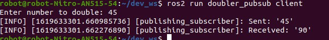
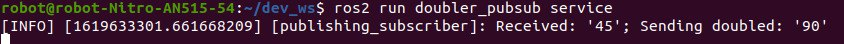

# ros2-number-doubler

## Services and Clients
ROS2 services and clients are usually used for computations and quick actions, and rely on server-client relationship. Tutorial describing a way to implement a C++ service and client using internal `rclcpp::Service` and `rclcpp::Client` classes is available here: https://docs.ros.org/en/foxy/Tutorials/Writing-A-Simple-Cpp-Service-And-Client.html. In this tutorial, the client sends two integer to the service node that adds them up and return back to the client.

## Number doubling

This ROS2 package, on the other hand, demonstrates a way to implement service-like application that only use publishers and subscribers. Moreover, the addition operation is replaced by integer doubling operation. 

On a top level, the general structure of service and client is preserved, as package contains two nodes that emulate similar behaviour. The client node sends the number to the service node that does the computation and returns the result back.

## Service node
Let's first understand the working principle of the service node. Inside the `subscriber_service_member_function.cpp` file you will find the following code:

```
#include "rclcpp/rclcpp.hpp"
#include "std_msgs/msg/int64.hpp"
using std::placeholders::_1;
 
class PublishingSubscriber : public rclcpp::Node
{
  public:
    PublishingSubscriber()
    : Node("publishing_subscriber")
    {
      subscription_ = this->create_subscription<std_msgs::msg::Int64>(
      "input_int", 10, std::bind(&PublishingSubscriber::topic_callback, this, _1));
      publisher_ = this->create_publisher<std_msgs::msg::Int64>("doubled_int",10);  
    }
 
  private:
    void topic_callback(const std_msgs::msg::Int64::SharedPtr msg) const
    {
      auto message = std_msgs::msg::Int64();
      message.data = 2 * msg->data;
      RCLCPP_INFO(this->get_logger(), "Received: '%d'; Sending doubled: '%d'", msg->data, message.data);
      publisher_->publish(message);
    }
    rclcpp::Subscription<std_msgs::msg::Int64>::SharedPtr subscription_;
    rclcpp::Publisher<std_msgs::msg::Int64>::SharedPtr publisher_;
};
 
int main(int argc, char * argv[])
{
  rclcpp::init(argc, argv);
  rclcpp::spin(std::make_shared<PublishingSubscriber>());
  rclcpp::shutdown();
  return 0;
}
```

### Code explanation
The `#include` statements include package dependencies and message type used by the service.
```
#include "rclcpp/rclcpp.hpp"
#include "std_msgs/msg/int64.hpp"
using std::placeholders::_1;
```

The `PublishingSubscriber` objects inherits the `Node` class and is used to define publishing and subscribing topics. As the first step the service subscribes to the `input_int` topic that publishes number sent from the client node. In addition, the publisher is initialized which is responsible for sending doubled number back to client. Both of them use `td_msgs::msg::Int64` message type.

```
subscription_ = this->create_subscription<std_msgs::msg::Int64>(
"input_int", 10, std::bind(&PublishingSubscriber::topic_callback, this, _1));
publisher_ = this->create_publisher<std_msgs::msg::Int64>("doubled_int",10);  
```

The `topic_callback` callback function is called whenever number is published in the `input_int` topic. The callback function reads the message data, multiplies it by two and publishes result in the `doubled_int` topic.

```
void topic_callback(const std_msgs::msg::Int64::SharedPtr msg) const
{
    auto message = std_msgs::msg::Int64();
    message.data = 2 * msg->data;
    RCLCPP_INFO(this->get_logger(), "Received: '%d'; Sending doubled: '%d'", msg->data, message.data);
    publisher_->publish(message);
}
```

The main function initializes ROS 2 C++ client library, creates a node and spins the `PublishingSubscriber` node.

```
rclcpp::init(argc, argv);
rclcpp::spin(std::make_shared<PublishingSubscriber>());
rclcpp::shutdown();
return 0;
```


## Client node
Although the client has a different purpose, they both rely on a similar publisher and subscriber in one node structure. Inside the `publisher_client_member_function.cpp` file you will find the following code:

```
#include "rclcpp/rclcpp.hpp"
#include "std_msgs/msg/int64.hpp"
using std::placeholders::_1;

class PublishingSubscriber : public rclcpp::Node
{
  public:
    PublishingSubscriber()
    : Node("publishing_subscriber")
    {
      subscription_ = this->create_subscription<std_msgs::msg::Int64>(
      "doubled_int", 10, std::bind(&PublishingSubscriber::topic_callback, this, _1));
      publisher_ = this->create_publisher<std_msgs::msg::Int64>("input_int",10);  

      std_msgs::msg::Int64 message;
      std::string inputString;
      std::cout << "Enter number to double: ";
      std::getline(std::cin, inputString);
    
      std::istringstream iss(inputString);
      long num;
      if (!(iss >> num).fail()) {
        message.data = num;
        RCLCPP_INFO(this->get_logger(), "Sent: '%d'", message.data);
        try {
          publisher_->publish(message);
        } catch (const rclcpp::exceptions::RCLError & e) {
          RCLCPP_ERROR(
          this->get_logger(),
          "unexpectedly failed with %s",
          e.what());
        }
      }
      else {
        std::cerr << "Please enter valid number!" << std::endl;
        rclcpp::shutdown();
      }
    }
 
  private:
    void topic_callback(const std_msgs::msg::Int64::SharedPtr msg) const
    {
      RCLCPP_INFO(this->get_logger(), "Received: '%d'", msg->data);
      rclcpp::shutdown();
    }
    rclcpp::Subscription<std_msgs::msg::Int64>::SharedPtr subscription_;
    rclcpp::Publisher<std_msgs::msg::Int64>::SharedPtr publisher_;
};
 
int main(int argc, char * argv[])
{
  rclcpp::init(argc, argv);
  rclcpp::spin(std::make_shared<PublishingSubscriber>());
  // rclcpp::shutdown();
  return 0;
}
```

### Code explanation
The `#include` statements include package dependencies and message type used by the client.
```
#include "rclcpp/rclcpp.hpp"
#include "std_msgs/msg/int64.hpp"
using std::placeholders::_1;
```

In a similar manner to service, the `PublishingSubscriber` objects inherits the `Node` class and is used to define publishing and subscribing topics. In contrast to the service, the client publishes the number in the `input_int` topic and subscribes to the `doubled_int` topic, where it receives the result that is visualized to the user.

```
publisher_ = this->create_publisher<std_msgs::msg::Int64>("input_int",10);  
subscription_ = this->create_subscription<std_msgs::msg::Int64>(
"doubled_int", 10, std::bind(&PublishingSubscriber::topic_callback, this, _1));
```

The `PublishingSubscriber` is initailized with prompting a user to input the number that will be doubled. Then the input is validated and in case of failure asks the user to input a valid number. In case of a success, the number is published to the `input_int` topic.

```
std_msgs::msg::Int64 message;
std::string inputString;
std::cout << "Enter number to double: ";
std::getline(std::cin, inputString);

std::istringstream iss(inputString);
long num;
if (!(iss >> num).fail()) {
    message.data = num;
    RCLCPP_INFO(this->get_logger(), "Sent: '%d'", message.data);
    try {
        publisher_->publish(message);
    } catch (const rclcpp::exceptions::RCLError & e) {
        RCLCPP_ERROR(
        this->get_logger(),
        "unexpectedly failed with %s",
        e.what());
    }
}
else {
    std::cerr << "Please enter valid number!" << std::endl;
    rclcpp::shutdown();
}
```

Finally, when the client receives a message from the service on a `doubled_int` topic it prints that information and shuts down the client.ss
```
void topic_callback(const std_msgs::msg::Int64::SharedPtr msg) const
{
    RCLCPP_INFO(this->get_logger(), "Received: '%d'", msg->data);
    rclcpp::shutdown();
}
```


## Code execution
In order to run the code, 

```
$ colcon build --packages-select doubler_pubsub
```

In two new terminal windows run following commands:
```
$ ros2 run doubler_pubsub service 
```

```
$ ros2 run doubler_pubsub client
```

The client will ask you to input the number and send it on "Enter" button press. The doubled result is printed immediately afterwards. In order to send a new number just call the client script again. 



The service node will continue to spin and wait for new calls.

